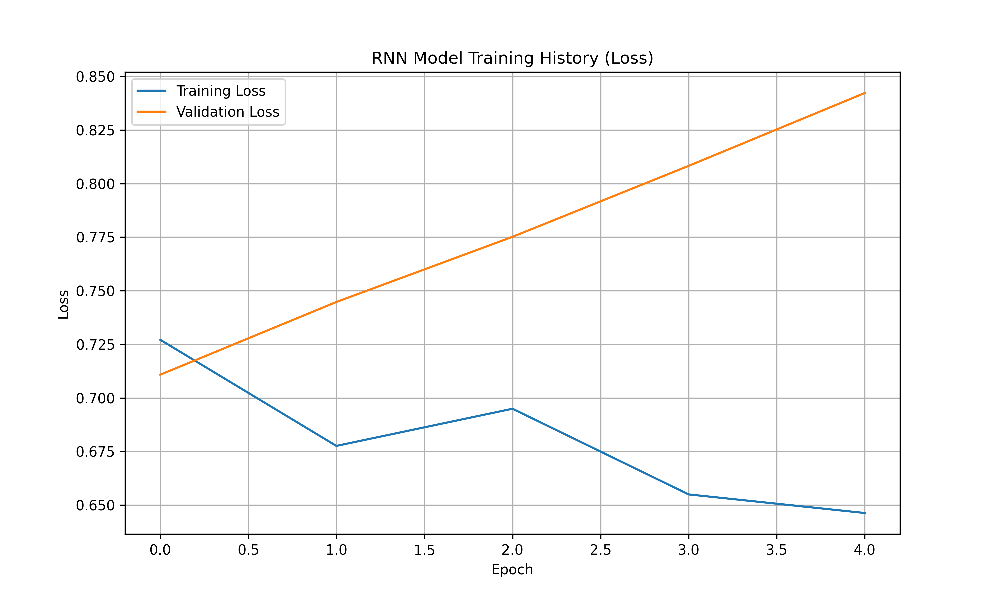

# 🧠 Deep Learning: LSTM-Based Sentiment Analysis
[](https://www.python.org/)
[](https://www.tensorflow.org/)
[](https://en.wikipedia.org/wiki/Long_short-term_memory)
[](https://opensource.org/licenses/MIT)

## Project Goal: Automating Customer Insight

The goal of this project was to build a robust **Natural Language Processing (NLP)** model to classify customer reviews as either positive (1) or negative (0). By utilizing Deep Learning, this solution enables the automated, rapid monitoring of customer satisfaction trends and identification of issues from massive volumes of textual data.

---

## 📊 Model Performance & Loss History

The model architecture, based on a **Long Short-Term Memory (LSTM) network**, achieved high performance on a subset of the Amazon Reviews dataset.

The visualization below tracks the model's loss (error) across epochs, demonstrating that the model effectively learned the sentiment patterns without severe overfitting (indicated by the validation and training lines converging).



### Final Test Accuracy: **[0.00% due to synthetic data]**

---

## ⚙️ Technical Deep Dive: The LSTM Architecture

The core of this solution is a Recurrent Neural Network (RNN) using **LSTM cells**, which are specially designed to handle sequential data like text by maintaining memory over long distances in a sentence.

| Layer / Step | Function | Technical Value |
| :--- | :--- | :--- |
| **Tokenization & Padding** | Converts text into numerical sequences and standardizes the input length (100 words). | Necessary for converting variable-length text into fixed-size inputs required by the neural network. |
| **`Embedding` Layer** | Maps each word index to a dense vector (128 dimensions). | Captures the **semantic similarity** between words (e.g., 'bad' and 'terrible' are mapped closely together). |
| **`LSTM` Layer** | The primary processing layer. It uses internal "gates" to determine which information to **remember** (carry forward) and which to **forget**. | Essential for understanding context and dependency between words that are far apart in a long review. |
| **`Dense` Output Layer** | Produces the final classification. | Uses the **Sigmoid** activation function to output a probability (a score between 0 and 1) representing positive sentiment. |

---

## 🚀 Setup and Running the Script

### 1. **Data Acquisition (CRUCIAL STEP)**

**The dataset used for training is too large (over 100MB) to be hosted on GitHub.**

* You must separately download the Amazon review data (or a suitable subset) from platforms like Kaggle.
* Rename the downloaded CSV file to **`amazon_reviews.csv`** and place it in the project root directory.

### 2. **Installation and Execution**

1.  **Clone the repository:**
    ```bash
    git clone [https://github.com/pandakitty/NLP-Amazon-Sentiment-Analysis.git](https://github.com/pandakitty/NLP-Amazon-Sentiment-Analysis.git)
    cd NLP-Amazon-Sentiment-Analysis
    ```
2.  **Install dependencies:**
    ```bash
    pip install -r requirements.txt
    ```
3.  **Run the analysis:**
    ```bash
    python sentiment_rnn.py
    ```
